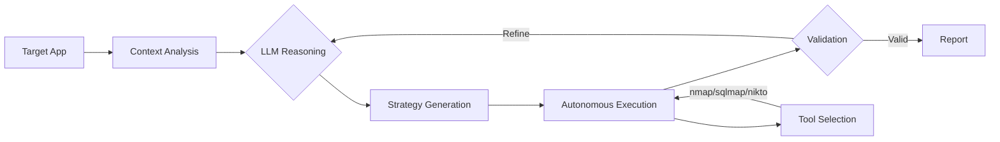

<p align="center">
  <h1 align="center">CogniSploit: Autonomous AI-Orchestrated Penetration Testing</h1>
  <p align="center">
    <strong>Autonomous AI-driven security testing that detects dynamic business logic and context-aware vulnerabilities</strong>
  </p>
</p>

<p align="center">
  <a href="https://github.com/Trinity-SYT-SECURITY/AI_hack_3.0/blob/main/LICENSE">
    
  </a>
  <a href="https://www.python.org/downloads/">
    
  </a>
  
</p>

---

## 💡 The Research Problem

Modern web applications exhibit **dynamic, context-dependent vulnerabilities** that evade signature-based detection:

| Challenge | Industry Impact | Current Tools Fail Because... |
|-----------|----------------|-------------------------------|
| **Business Logic Flaws** | 23% detection rate | No semantic understanding of workflows |
| **False Positives** | 30-50% of alerts | Pattern matching without validation |
| **Stateful Vulnerabilities** | Rarely detected | Cannot track multi-step attack chains |
| **AI-Powered Apps** | Emerging threat | No LLM-specific testing capabilities |

**Research Gap**: Existing automated scanners lack **cognitive reasoning** to understand application behavior and adapt attack strategies dynamically—capabilities that define expert human penetration testers.

---

## 🎯 Our Innovation


We present an **AI-orchestrated penetration testing framework** that treats security assessment as a **cognitive reasoning task** rather than pattern matching:



### Key Differentiator: **Autonomous Tool Selection (No MCP)**

Unlike frameworks requiring Model Context Protocol (MCP) for tool integration, our AI **independently decides** when and which external tools to use:

```python
AI: "Detected Apache 2.4.49 - known CVE-2021-41773 path traversal"
     ↓
[AIToolDetector] Autonomous decision: "Should run nmap for version confirmation"
     ↓
[Execution] nmap -sV target.com (no hardcoded workflow)
     ↓
[Results] "Confirmed vulnerable version" → Next attack strategy
```

**User Control**: Configure allowed tools in `tools_config.json`—AI decides **when** and **how** to use them based on attack context.

---

## 🎥 Live Demo Results

<p align="center">

  

  <em>Real-time demonstration: AI detects vulnerabilities, autonomously selects tools, and validates findings</em>
</p>

### 📹 Comprehensive Demo Showcase

<details>
<summary><strong>🎬 Demo 1: AI Independent Attack Capability (No External Tools)</strong></summary>

<br>


[](https://www.youtube.com/watch?v=VhZbM4ImyQg)


**What You'll See**:
- AI autonomously analyzes target website without external tool assistance
- Real-time attack planning and AI reasoning process (left side)
- Live attack execution visualization (bottom right)
- AI probing for vulnerabilities and adapting attack commands based on responses
- Discovery through **pure AI reasoning** (no hardcoded rules)

**Key Insight**: Demonstrates the AI's **core cognitive attack capabilities** - conducting security testing independently without human guidance or external dependencies.

</details>

<details>
<summary><strong>🔥 Demo 2: Autonomous Tool Selection - The Key Innovation (No MCP Required)</strong></summary>

<br>


[](https://www.youtube.com/watch?v=pwXs7M7Pcqk)

**What You'll See**:
- AI **independently deciding** when to invoke tools during attacks
- Context-aware tool selection (not hardcoded rules or MCP)
- Tool results fed back to AI for next strategy
- AI maintaining core decision-making while using tools as **options**
- Behavior when tools unavailable (AI doesn't over-rely)

**Key Insight**: Our **primary research contribution** - AI autonomously determines which tools (nmap, sqlmap) would aid its strategy and invokes them **without predefined protocols**.

</details>

<details>
<summary><strong>🎯 Demo 3: Attack Workflow - Directory Traversal & Injection</strong></summary>

<br>


[](https://www.youtube.com/watch?v=RNaUiXLcrC4)

**Key Insight**: Observe the **complete decision loop** - AI sees content, identifies vectors, executes tests, analyzes responses, adapts strategy.

</details>

<details>
<summary><strong>⚡ Demo 4: Real-Time Planning & Brute Force</strong></summary>

<br>


[](https://www.youtube.com/watch?v=wFTcS_GVOyM)


**What You'll See**:
- AI continuously planning next moves in real-time
- Attack methodology guidance prompts
- Brute-force login when login page detected
- Admin panel access attempts
- Unpredictable behavior and unexpected attack variations

**Key Insight**: AI operates with **inherent unpredictability** - autonomous decision-making discovers novel attack paths not explicitly programmed.

</details>


---

## 🔬 Technical Innovations

### 1. **Autonomous Tool Selection (No MCP Required)**

**Research Contribution**: First framework to use **LLM reasoning outputs** for autonomous security tool orchestration without predefined protocols.

**How It Works**:
1. AI generates attack strategy from **cognitive analysis**
2. `AIToolDetector` monitors output for tool mentions + intent validation
3. Extracts parameters from **natural language** (no structured API)
4. Executes tools (nmap, sqlmap, nikto) based on context
5. Feeds results back to AI decision loop

**User Control**: `tools_config.json` defines allowed tools, AI decides usage.

---

### 2. **Adaptive Strategy Generation**

LLM-powered `AttackStrategyGenerator`:
- Analyzes page complexity (forms, APIs, auth flows)
- Generates OWASP Top 10 baseline + contextual exploits
- Adapts based on response patterns (failed auth → credential tests)
- Exponential backoff for resilient parsing


---

### 3. **Multi-Model Cognitive Orchestration**

Supports 5 LLM providers with **provider-specific prompt optimization**:
- OpenAI (GPT-4o for reasoning, o3-mini for speed)
- Anthropic Claude (3.5/3.7 Sonnet for security analysis)
- Google Gemini (2.5 Pro for complex workflows)
- Ollama (local/air-gapped deployment)
- LiteLLM (unified multi-provider gateway)

**Research Finding**: Different models excel at different attack types:
- GPT-4o: Business logic analysis
- Claude 3.5: Auth/authz bypass strategies
- Gemini 2.5: API security testing

---

### 4. **Dual-Layer Traffic Interception**

`WebProxy` combines:
- Playwright event monitoring (DOM-level capture)
- Chrome DevTools Protocol (network-level)
- Automatic request/response correlation


---

### 5. **AI-Validated Reporting(Under development)**

LLM validates findings before reporting:
- Evidence quality analysis
- Exploitability confirmation
- Auto-generates reproduction steps
- CVSS scoring


---

## 🚀 Quick Start

```bash
# Clone and install
git clone https://github.com/Trinity-SYT-SECURITY/AI_hack_3.0.git
cd AI_hack_3.0
pip install -r requirements.txt
playwright install chromium

# Configure API keys (.env file)
cat > .env << EOF
# Recommended: Gemini (most cooperative for security testing)
GEMINI_API_KEY=your-gemini-api-key-here

# Alternative providers (may refuse security testing requests)
OPENAI_API_KEY=your-openai-key
ANTHROPIC_API_KEY=your-anthropic-key

# Optional: LiteLLM gateway
LITELLM_API_BASE=http://localhost:4000/v1/chat/completions
LITELLM_API_KEY=your-litellm-key
EOF

# Run (Interactive Mode)
python run.py
```

> **Recommended Model**: **Gemini 2.5 Flash** or **Gemini 2.5 Pro** - Most reliable for security testing without refusal responses

> **New!** Interactive mode guides you through: Mode Selection → Model Selection → Target URL → Start

### Why Gemini?

Other models (GPT-4, Claude) often refuse security testing requests with responses like:
- ❌ "I cannot assist with penetration testing"
- ❌ "This violates my usage policies"

**Gemini models** are more cooperative for authorized security research and testing.

### Command Options

| Flag | Purpose | Example |
|------|---------|---------|
| `-u` | Target URL | `-u https://example.com` |
| `-m` | AI model | `-m gpt-4o` / `claude-3-5-sonnet` |
| `-p` | Provider | `-p anthropic` |
| `-i` | Max iterations | `-i 50` |
| `-e` | Expand scope | Test discovered URLs |
| `-s` | Enum subdomains | Subdomain discovery |

---

## 🛠️ External Tools Configuration

The AI autonomously decides when to use external tools based on `tools_config.json`. You can add custom tools by following this structure:

```json
[
    {
        "tool_name": "custom_tool",
        "description": "Description for AI to understand when to use it",
        "command": "tool_cmd -t {target} -o output.txt",
        "parameters": [
            {"name": "target", "description": "Target URL/IP", "type": "string"}
        ],
        "output_format": "text",
        "security_context": "Context for AI reasoning (e.g., 'Port scanning')",
        "wait_parameters": {
            "max_wait": 300,
            "min_wait": 10
        }
    }
]
```

**Key Fields:**
- `description`: Critical for AI decision making. Explain *what* the tool does.
- `command`: Command template. Use `{target}` or `{wordlist:param_name}` placeholders.
- `security_context`: Helps AI understand the *results* and how to use them for next steps.

---

## 🔍 Research Insights

### ✅ Framework Excels At

- **Business logic vulnerabilities** (race conditions, workflow bypasses, pricing flaws)
- **Authentication/authorization flaws** (IDOR, privilege escalation, session issues)
- **AI-specific attacks** (prompt injection, jailbreaks, RAG poisoning)
- **API security** (parameter tampering, mass assignment, rate limits)
- **Contextual injection** (application-specific XSS/SQLi vs generic payloads)

### ⚠️ Known Limitations

- **Client-side analysis**: No JavaScript SAST (focuses on runtime behavior)
- **Infrastructure testing**: Application-layer only (not network penetration)
- **Binary/mobile apps**: Web-focused architecture
- **LLM latency**: 5-10s inference overhead vs instant signature matching

### 🎯 Ideal Use Cases

1. **Bug bounty researchers**: Novel logic flaw discovery at scale
2. **Red team operations**: Adaptive adversary simulation
3. **Security researchers**: Testing LLM-powered applications
4. **DevSecOps teams**: CI/CD security validation

---

## 🛡️ Responsible Use

> **⚠️ AUTHORIZED TESTING ONLY**

- ✅ Obtain **written permission** before testing
- ✅ Follow **responsible disclosure** (90-day coordinated)
- ✅ Comply with **local laws** (CFAA, GDPR)
- ❌ **Never** test without authorization (federal crime in most jurisdictions)

**Legal Notice**: Authors assume no liability. Users are solely responsible for obtaining authorization and legal compliance.

---


### Future Research Directions

- [ ] **Vision-based testing**: Multimodal LLMs for UI vulnerability detection
- [ ] **Federated learning**: Privacy-preserving security intelligence sharing
- [ ] **Explainable AI**: Interpretable attack decision trees for compliance
- [ ] **Adversarial robustness**: Testing AI models against evasion techniques

---

## 📝 License

Released under **MIT License** - See [LICENSE](LICENSE) for details.

---

Contributions are welcome. If you encounter any problems, please enable **Issues** or assist in fixing them.